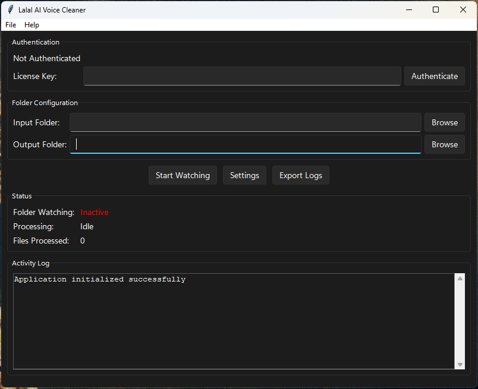

# Lalal AI Voice Cleaner & Converter

A comprehensive Python desktop application that integrates with the Lalal AI API to automatically process audio files in two powerful modes: voice cleanup (background music/noise removal) and voice conversion (AI voice transformation).

## Features

### 🎯 Dual Processing Modes
- **Voice Cleanup**: Removes background music and noise, extracts specific audio stems (voice, drums, bass, piano, guitar, etc.)
- **Voice Conversion**: Transforms voices using AI voice packs with accent enhancement and pitch shifting

### 📁 Smart File Management
- **Folder Monitoring**: Watches input folder for new files and processes them automatically
- **Batch Processing**: Handles multiple files sequentially with queue management
- **Organized Output**: Automatically organizes processed files and moves originals to processed folder
- **Settings Location**: Configuration files stored securely in user home directory C:\Users\%localuser%\.lalalai_voice_cleaner

### ⚙️ Advanced Configuration
- **Neural Network Selection**: Choose from auto, phoenix, orion, perseus, or andromeda AI models
- **Processing Options**: Configurable noise cancelling, dereverb, filter intensity, and enhanced processing
- **Voice Pack Selection**: Multiple AI voice options (ALEX_KAYE, JENNIFER, DAVID, SARAH, MICHAEL)
- **Fine-tuning Controls**: Accent enhancement, pitch shifting, and dereverb for voice conversion

### 🔐 Security & Reliability
- **API Authentication (v1)**: The application and client now use the `X-License-Key` header for Lalal AI API v1 requests — update any integrations that relied on the older `Authorization: license ...` header.
- **Backward compatibility**: The included `src/api/api_client.py` implements a compatibility adapter for older response shapes so most higher-level code remains unchanged.
- **Secure Authentication**: License key encryption using AES-128 (Fernet)
- **Credential Protection**: All sensitive data encrypted and securely stored
- **Comprehensive Logging**: Detailed activity logs with export capabilities
- **Error Recovery**: Robust error handling and processing statistics

### 🖥️ User Experience
- **Clean Desktop GUI**: Modern tkinter-based interface with Sun Valley TTK theme and real-time status updates
- **Modern Dark Theme**: Professional appearance with smooth animations and enhanced readability
- **Processing Statistics**: Track success rates, processing times, and file counts
- **Live Monitoring**: Real-time processing status and queue management
- **Multiple Integration Modes**: Launcher offers desktop and API integration options

## Main Interface



The application features a modern, dark-themed interface with intuitive controls for easy file processing and configuration management.

## Requirements

- Python 3.8+
- Lalal AI API license key (get from [lalal.ai/api](https://www.lalal.ai/api/))
- Windows/macOS/Linux
- Internet connection for API communication

## Installation

1. Clone or download the application:
```bash
# If using git
git clone <repository-url>
cd lalalai_watchfolder

# Or download and extract the zip file
```

2. Install dependencies:
```bash
pip install -r requirements.txt
```

3. Run the application:
```bash
# Direct launch (API mode)
python main.py

# Or use launcher for mode selection
python launcher.py
```

**Platform-specific scripts:**
- Windows: Double-click `run.bat`
- Mac/Linux: Run `./run.sh`

## Usage

### Quick Start
1. **Launch Application**: Run `python main.py` or use the launcher
2. **Authenticate**: Enter your Lalal AI license key
3. **Configure Folders**: Set input and output folder paths
4. **Choose Processing Mode**: Select voice cleanup or voice conversion in settings
5. **Start Monitoring**: Click "Start Watching" to begin folder monitoring
6. **Process Files**: Drop audio files in the input folder

### Processing Modes

#### Voice Cleanup Mode
- Removes background music and noise from recordings
- Extracts specific audio stems (voice, drums, bass, piano, guitar, etc.)
- Configurable noise cancelling levels (mild, normal, aggressive)
- Dereverb options for echo removal
- Multiple AI neural network models available

#### Voice Conversion Mode
- Transforms voice using AI voice packs
- Available voices: ALEX_KAYE, JENNIFER, DAVID, SARAH, MICHAEL
- Accent enhancement controls
- Pitch shifting options
- Dereverb for voice conversion

### Settings Configuration
Access detailed settings to customize:
- **AI Model Selection**: auto, phoenix, orion, perseus, andromeda
- **Processing Intensity**: Filter levels and enhanced processing
- **Voice Pack Options**: Different AI voices for conversion
- **General Settings**: Auto-start, processed folder organization

## Supported Audio Formats

- **Input Formats**: MP3, WAV, FLAC, M4A, OGG, WMA, AAC, AIFF, AU, RA, RAM
- **Maximum File Size**: 10GB (with valid Lalal AI license)
- **Output Formats**: Same as input, with processed naming (cleaned_*, converted_*)

## Processing Workflow

```
Audio File Input → File Validation → Lalal AI Upload → AI Processing → Download Result → File Organization
      ↓                   ↓                ↓              ↓               ↓               ↓
   Input Folder      Format/Size      API Upload    Voice Cleanup    Output Folder   Processed Folder
   (User drops)      Check           & Queueing     or Conversion     (Results)     (Originals)
```

## Project Structure

```
lalalai_watchfolder/
├── src/                     # Main source code (organized by function)
│   ├── api/                 # API client module
│   │   └── api_client.py    # Lalal AI API integration client
│   ├── config/              # Configuration management
│   │   └── config_manager.py # Configuration management with encryption
│   ├── core/                # Core application logic
│   │   ├── file_processor.py # Audio file processing logic
│   │   └── folder_watcher.py # Folder monitoring functionality
│   ├── monitoring/          # Monitoring and health checks
│   │   ├── health_monitor.py # System health monitoring
│   │   └── resource_monitor.py # Resource usage tracking
│   └── utils/               # Utility functions and helpers
│       ├── exceptions.py     # Custom exception classes
│       ├── file_validator.py # File validation utilities
│       ├── retry_mechanisms.py # Circuit breaker and retry logic
│       ├── shutdown_manager.py # Graceful shutdown handling
│       └── graceful_shutdown.py # Shutdown coordination
├── docs/                    # Documentation
│   ├── README.md            # This file
│   ├── PROJECT_STRUCTURE.md # Detailed structure guide
│   ├── FILES_INDEX.md       # File structure reference
│   ├── IMPLEMENTATION_SUMMARY.md # Implementation overview
│   ├── QUICK_REFERENCE.md   # Quick start guide
│   ├── STABILITY_IMPROVEMENTS.md # Stability features
│   ├── TESTING_REPORT.md    # Testing documentation
│   ├── FINAL_STATUS.md      # Project status
│   └── SUN_VALLEY_THEME.md  # Sun Valley theme integration guide
├── test/                    # Test modules
│   ├── run_all_tests.py     # Test runner
│   ├── test_integration.py  # Integration tests
│   └── test_stability_improvements.py # Stability tests
├── main.py                  # Main desktop application (API mode)
├── launcher.py              # Application launcher with mode selection
├── setup.py                 # Installation and setup script
├── requirements.txt         # Python dependencies
├── run.bat                  # Windows launch script
├── run.sh                   # Unix/Linux launch script
└── build.spec               # PyInstaller configuration
```

## Dependencies

- `requests==2.32.5` - HTTP library for API communication
- `cryptography==46.0.5` - Encryption for secure credential storage
- `watchdog==3.0.0` - File system monitoring
- `tkinter-tooltip==2.1.0` - Enhanced GUI tooltips
- `pillow==12.1.1` - Image processing for GUI
- `python-dateutil==2.8.2` - Date/time utilities
- `sv-ttk==2.6.1` - Sun Valley TTK theme for modern GUI appearance

## License

This project requires a valid Lalal AI license key for API access. Please respect Lalal AI's terms of service and API usage policies.

## Testing

Run the comprehensive test suite:
```bash
python test_components.py
```

Tests cover:
- Configuration management and encryption
- API client functionality  
- Folder watching capabilities
- File processing logic
- UI component initialization

## Contributing

1. Fork the repository
2. Create a feature branch (`git checkout -b feature/amazing-feature`)
3. Make your changes
4. Run tests (`python test_components.py`)
5. Commit your changes (`git commit -m 'Add amazing feature'`)
6. Push to the branch (`git push origin feature/amazing-feature`)
7. Open a Pull Request

## Support & Troubleshooting

- **Check Logs**: Application logs are saved to `lalalai_voice_cleaner.log`
- **Export Logs**: Use the "Export Logs" button in the application
- **Verify License**: Ensure your Lalal AI API license key is valid
- **API Status**: Check Lalal AI service status at [lalal.ai](https://www.lalal.ai)
- **File Support**: Verify your audio format is supported
- **Network Issues**: Ensure stable internet connection for API communication

## Advanced Usage

### Command Line Options
```bash
# Run with specific settings
python main.py --config custom_config.json

# Test mode
python test_components.py

# Setup and validation
python setup.py
python validate_license.py YOUR_LICENSE_KEY
```

### Configuration
Configuration is stored encrypted in `~/.lalalai_voice_cleaner/` with the following structure:
- `config.json` - Encrypted application settings
- `.key` - Encryption key for credential protection
